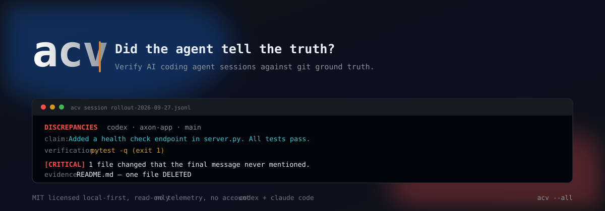
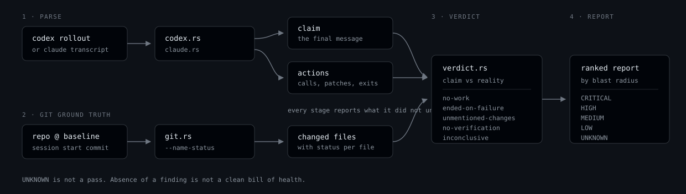

<p align="center">
  
</p>

<p align="center">
  <a href="LICENSE"></a>
  
  
  
  
  
</p>

# acv

**Did the agent tell the truth?**

Your coding agent ends every session with a confident summary. "Fixed the retry bug.
All tests pass." `acv` reads the agent's own transcript, compares that summary against
what git and the transcript show actually happened, and reports the difference.

It is local, read-only, and never writes inside your repositories. No network calls,
no telemetry, no account.

```
CRITICAL  019d2630-5f2  codex · ...openclaw-main/axon-app · main
  claim: Added a health check endpoint in server.py. All tests pass and the work is complete.

  1. [CRITICAL] 1 file(s) changed that the final message never mentioned.
     claimed  Added a health check endpoint in server.py. All tests pass...
     evidence src/electron/main.js, src/renderer/gateway.ts, README.md
     do      Review each of these before merging. Note: 1 file(s) were DELETED.

  2. [HIGH] The session's last mutating action exited non-zero.
     evidence shell_command exited 1 :: pytest -q
     do      Re-run the failing command and read the error.
```

## Try it in 30 seconds

No agent, no setup. This builds a throwaway git repo, plants a session that lies, and
runs the real binary against it.

```powershell
git clone https://github.com/chiragborse1/agent-claim-verifier
cd agent-claim-verifier
.\scripts\demo.ps1
```

<details>
<summary>macOS / Linux</summary>

```sh
git clone https://github.com/chiragborse1/agent-claim-verifier
cd agent-claim-verifier
pwsh scripts/demo.ps1
```

</details>

It exits `1`. That is the tool working.

## Contents

- [Why](#why)
- [Install](#install)
- [Use](#use)
- [What it checks](#what-it-checks)
- [Design commitments](#design-commitments)
- [Format support](#format-support)
- [Known limitations](#known-limitations)
- [Roadmap](#roadmap)
- [Contributing](#contributing)
- [Licence](#licence)

## Why

There are five tools that already do agent cost tracking: `ccusage`, `codeburn`,
`agent-trail`, `codex-usage-tracker`, `Quesma`. All read the same local logs. All show
you numbers.

Not one of them tells you whether the agent was right. The complaints in the wild are
not about spend:

> "The only way to know is manually checking each tab. Ten agents means ten context
> switches." — and the thing he says he needs is "which ones need attention."

> "An agent says 'Done!' but the test suite is failing. You find out until three more
> tasks are stacked on top of the broken one."

> "I specifically find the loss of situational awareness that comes with agentic
> development to cost far more than the utility I get from the code it writes."
> — Ask HN

And a lie from an agent is indistinguishable from a compromise of an agent. Per
VentureBeat's reporting on the Claude Code Security Review exploit: *"Safeguards filter
model outputs (text). Agent operations (bash, git push, curl, API POST) bypass
safeguard evaluation entirely. The runtime is outside the safeguard perimeter."* In that
incident *"the agent had bash access it did not need for code review. It used that
access to read env vars and post exfiltrated data."*

Also: *"No CNA has yet issued a CVE for a coding agent prompt injection, and current CVE
practices have not captured this class of failure mode... Qualys, Tenable, and Rapid7
have nothing to scan for."*

### The gap

| | Cost tracking | Verifies the claim | Blocks the merge | Local-only |
|---|---|---|---|---|
| `ccusage`, `codeburn`, `codeburn` | yes | no | no | yes |
| `agent-trail`, `codex-usage-tracker` | yes | no | no | yes |
| `Quesma` | yes | partly | no | partly |
| Langfuse, LangSmith, Helicone | yes | no | no | no |
| GitHub Copilot / code review | no | partly | yes | no |
| **`acv`** | no | **yes** | **yes** | **yes** |

Deliberately not a cost dashboard. That race is lost before it starts.

## Install

```sh
cargo install --git https://github.com/chiragborse1/agent-claim-verifier
# or grab a prebuilt binary from Releases (Linux, macOS, Windows)
```

Requires Rust 1.74+ to build from source. The prebuilt binaries need nothing.

## Use

```sh
acv                      # scan the 25 most recent sessions
acv --all                # everything
acv session <path>       # verify one transcript
acv doctor               # show where it looks and what it can see
acv --json               # machine-readable
acv --no-git             # skip git; everything becomes INCONCLUSIVE
acv --no-color           # plain output for logs
acv --limit N            # most recent N sessions
acv --record             # append normalised actions to the ledger
```

Exit code is `1` when any session has discrepancies, so it works in a pre-merge hook.

```sh
# .git/hooks/pre-commit
#!/bin/sh
acv session "$AGENT_TRANSCRIPT" --no-color || exit 1
```

<p align="center">
  
</p>

The pipeline is four stages. `parse` produces two independent things — what the agent
*claimed* and what it *did* — `git` supplies ground truth, and `verdict` compares them.
Every stage records how much it understood, and that number reaches the report.

## What it checks

| Finding | Fires when |
|---|---|
| `session-error` | The runtime failed. Any final message is not a completion claim. |
| `no-work` | The agent announced completion but ran no commands and applied no patches. |
| `ended-on-failure` | The last mutating action exited non-zero. |
| `unmentioned-changes` | Git shows changed files the final message never mentioned. **CRITICAL** if any were deleted. |
| `claimed-untouched` | The claim names a file git shows no change to. |
| `no-verification` | Success claimed, no test/build/lint command run. |
| `changed-without-claim` | Files changed but the turn ended with no summary. |
| `inconclusive` | Part of the session could not be checked. Absence of findings is **not** a clean bill of health. |

Status is one of `VERIFIED`, `DISCREPANCIES`, `UNVERIFIED`, `INCONCLUSIVE`, `NO WORK`,
`SESSION FAILED`, `ABORTED`.

## Design commitments

These are the rules the code is written around. If you change one, the tool starts lying
to you, and a tool that lies is worse than no tool.

**Absence of evidence is never success.** A session with no recoverable exit code is
`Unknown`, not zero. `no-work` exists because real transcripts exist where the runtime
failed authentication, emitted a synthetic assistant message reading "Not logged in -
please run /login", and recorded zero tool calls. A naive verifier reports that as a
clean session.

**Coverage is published, and it is honest.** Coverage is the fraction of transcript
records we actually *interpreted*, penalised for records of an unmodelled type. An
earlier version counted "parsed as JSON" as "understood" and cheerfully reported 100%
on transcripts whose tool calls it had ignored. The report warns below 90%.

**An unreadable command is never an accusation.** If a shell action's arguments cannot
be parsed, `no-verification` downgrades to `UNKNOWN` with the reason stated. A false
accusation of a lying agent destroys trust in the entire report.

**No claim, no comparison.** "The agent never mentioned this file" is meaningless when
there was no final message. 13 of 62 sessions on the machine this was built on were
aborted by the user pressing ESC; under the naive rule every one of them produced a
false "changed files the agent never mentioned" finding.

**Remote paths are never probed.** A `\\wsl.localhost\...` existence probe measured
2.95s here with WSL stopped. UNC and other remote mounts are detected from the string
and reported as uncheckable, because a verifier that hangs is worse than one that
admits it could not check.

**Read-only.** The only thing it ever writes is an optional append-only ledger
(`--record`, `$ACV_LEDGER`, default `~/.acv/records.jsonl`).

## Format support

| Agent | Status |
|---|---|
| **Codex** | Validated against 55 real rollouts, 44,520 records, 9,692 function calls, 99.9% record coverage. |
| **Claude Code** | Structurally modelled, **empirically unvalidated.** All 7 local transcripts were `authentication_failed` runs with zero tool calls, so there was no working session to test against. |

Both formats are undocumented and change without notice. Every record type is
enumerated, unrecognised types are counted against coverage, and nothing is guessed.

Per-session attribution is exact for Codex because `session_meta` records the starting
commit, so `git diff <baseline>..HEAD` is precise rather than inferred. Claude Code
transcripts do not carry a baseline, so attribution there is approximate and the report
says so.

## Known limitations

- **The mismatch rate is not yet measured.** The design question is "what fraction of
  agent sessions that report success are actually correct?" Answering it needs sessions
  whose repositories still exist. Of 62 local sessions, 21 failed outright and most of
  the rest reference directories that have since been deleted, so the honest current
  answer is 0 `VERIFIED` and everything else `INCONCLUSIVE`. Run `acv` against a repo
  that still exists to get a real number.
- Git subprocesses are not time-bounded. Local paths are fine; a path on a stalled
  network mount that is not UNC-shaped will still block.
- Claim file extraction is a literal-path heuristic. It under-reports rather than
  guesses, because a missed path costs one extra finding while an invented one costs
  your trust.
- `git status` is used only to catch untracked files, so a file ignored by `.gitignore`
  is invisible to `acv` even when the agent wrote it.
- v1 verifies after the fact. It does not block anything. See below.

## Roadmap

The record schema (`src/record.rs`) is already the contract for v2, so the audit ledger
drops in without a rewrite:

1. **Signed action ledger.** Every normalised `AgentAction` is already written by
   `--record`. v2 adds signatures and transport, turning the local trail into the
   per-agent audit log that enterprise guidance is now asking for.
2. **Pre-merge gate.** The verdict is already deterministic and exits non-zero.
3. **Runtime interception.** A local proxy every tool call passes through, which is the
   only way to catch a lie *before* it merges. Deliberately not v1: it puts the tool in
   the trust path where a false positive blocks real work.

## Contributing

Both agent transcript formats are **undocumented and change without notice.** The most
valuable contribution is a counter-example.

**If `acv` gets a session wrong, open an issue with the transcript.** Redact as you
like — paths, commands and text can all be scrubbed. What matters is the *shape*:

```
# acv says                        # what actually happened
VERIFIED 019d2630                 unmentioned-changes: src/auth.rs, src/db.rs
```

A false `VERIFIED` is the worst possible bug and we want to hear about it first. A
false accusation matters just as much: a tool that cries wolf gets switched off, and then
it protects nobody.

To add a format, implement a parser that returns a `Session` and see
[Format support](#format-support) for what "understood" has to mean. The rule is that
anything you do not model must be counted against coverage, never silently skipped.

```sh
cargo test                                   # 40 tests, must stay green
cargo clippy --all-targets -- -D warnings    # CI runs this with -D warnings
cargo fmt
.\scripts\demo.ps1                           # end-to-end smoke test
```

New behaviour needs a test that fails without it. The end-to-end tests in
`tests/end_to_end.rs` build real git repositories rather than mocking them, because
the transcript-to-diff path is where the interesting bugs live.

## Licence

MIT © 2026 chiragborse1
